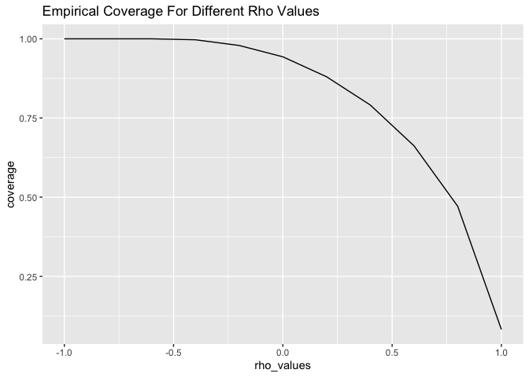

Simulation Study of Confidence Intervals in R
================
Eriola Hajro

|                                               |
|----------------------------------------------:|
| Simulation Study of Confidence Intervals in R |

**Research Question:** Examine how the correlation/level of dependence
of observations affects the empirical coverage probability of
normal-based CIs for random observations based on samples of size n=100
drawn from a normal population using a time series (autoregressive)
model.  

**Simulation Plan**  

1.  Draw samples of varying levels of dependence by using time-series
    data in an autoregressive (AR) model. Assume n=100 observations, and
    use rho values in increments of 0.2 starting at -1 and stopping
    at 1. The steps that follow describe the rest of the process for
    each rho value.
2.  Calculate the sample mean of the n=100 observations.
3.  Calculate the SE of the sample mean.
4.  Determine the critical value associated with a $95\%$ (normal-based)
    confidence level.
5.  Calculate the lower and upper bounds of the $95\%$ (normal-based)
    confidence interval.
6.  Check if the CI includes the true mean value.
7.  Return 3 objects: CI lower bound, CI upper bound, and the result of
    the check.
8.  Compare the empirical coverage probability results of different rho
    values.

**Simulation code:**

``` r
# the libraries
library(ggplot2)
library(dplyr)
# Generate AR(1) sample
generate_ar1_sample <- function(n, rho, mu=0, sigma=1) {
  epsilon <- rnorm(n, mean=0, sd=sigma)
  X <- rep(0, n)
  X[1] <- epsilon[1]
  for (t in 2:n) {
    X[t] <- rho * X[t-1] + epsilon[t]
  }
  return(X + mu)
}
```

``` r
# Compute 95% CI
compute_ci <- function(sample) {
  n <- length(sample)
  # mean of the sample
  mean_val <- mean(sample)
  # standard error calculation
  se <- sd(sample) / sqrt(n)
  # z scores for a 95% CI
  z <- abs(qnorm(0.05/2))
  # calculate lower and upper bounds of CI
  ci_lower <- mean_val - z * se
  ci_upper <- mean_val + z * se
  # check if the interval includes the true mean
  cover <- ci_lower <= 0 & 0 <= ci_upper
  return(c(ci_lower=ci_lower, ci_upper=ci_upper, cover=cover))
}
```

``` r
# function for one trial
trial <- function(n=100, rho_val) {
  # generate a sample of size n from a normal distribution 
  # with mean = 0, sd = 1 and with a correlation value rho_val
  sample <- generate_ar1_sample(n, rho=rho_val)
  compute_ci(sample)
}
```

``` r
set.seed(341)
# the values that rho will take
rho_values <- c(-1, -0.8, -0.6, -0.4, -0.2, 0, 0.2, 0.4, 0.6, 0.8, 1)
# a vector to save the coverage values
coverage <- rep(0, 11)
# a variable for the index in coverage
i <- 1
for (x in rho_values) {
  # replicate the trial 5000 times
  results <- replicate(5000, trial(rho_val = x))
  # save the results in a data frame
  results <- data.frame(t(results))
  # column names in the dataframe
  names(results) <- c("lower", "upper", "cover")
  # empirical coverage rate
  coverage[i] <- mean(results$cover)
  # increment the index of coverage
  i <- i+1
}
# make a dataset 
coverage_data <- data.frame(coverage, rho_values)
# plot the coverage values against the rho values
plot <- coverage_data %>% ggplot(aes(y = coverage, x = rho_values)) + geom_line() + ggtitle("Empirical Coverage For Different Rho Values")
```

**Results:**

``` r
coverage_data
```

    ##    coverage rho_values
    ## 1    1.0000       -1.0
    ## 2    1.0000       -0.8
    ## 3    1.0000       -0.6
    ## 4    0.9970       -0.4
    ## 5    0.9790       -0.2
    ## 6    0.9432        0.0
    ## 7    0.8802        0.2
    ## 8    0.7910        0.4
    ## 9    0.6622        0.6
    ## 10   0.4714        0.8
    ## 11   0.0822        1.0

``` r
plot
```

<!-- -->

**Conclusions:**

As rho values increased from -1 to 1, the proportion of confidence
intervals that contained the true average mean decreased. This is also
clearly shown in the graph that is included above. When rho=0, the
empirical coverage was closest to $95\%$, which was expected since rho=0
indicates that the observations are independent (which is what the
normal distribution assumes). The increasing positive rho values had
decreasing empirical coverage probabilities as expected since the closer
rho is to 1, the more correlated/dependent the observations are on one
another, making the normal-based confidence interval less accurate.
However, the negative values of rho all had empirical coverage
probabilities greater than that of rho=0 (independent observations),
which was not what was expected. But, upon further derivement, this
makes sense because the negative rho values cause the function to both
add and subtract randomly generated independent observations, while the
positive rho values only add these observations together. This allows
the observations in the samples based on the negative rho values to stay
closer to the mean while the positive rho samples stray further. This
allows the empirical coverage probability to be higher for the negative
rho values.
